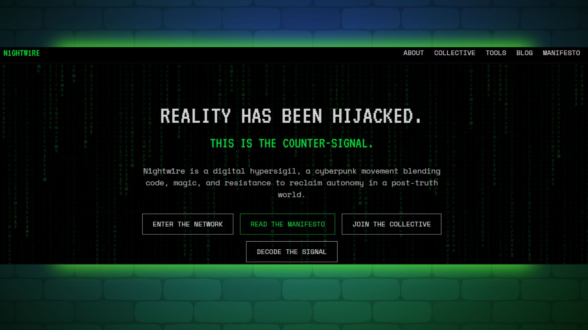

# N1GHTW1RE - Digital Liberation Collective



## 🌐 Live Site
**[Visit N1GHTW1RE](https://n1ghtw1re.com)**

## 📖 About

N1GHTW1RE is a decentralized collective of hackers, mystics, and digital dissidents fighting against surveillance capitalism, technobros, and fascism. This is our digital hypersigil, a cyberpunk movement blending code, magic, and resistance to reclaim autonomy in a post-truth world.

### Mission
- Develop open-source tools for digital liberation
- Publish books & zines on digital resistance
- Build alternate reality worlds and experiences
- Practice privacy activism
- Promote digital sovereignty and freedom

## 🚀 Technology Stack

This project is built with modern web technologies for optimal performance and maintainability:

### Core Technologies
- **React 18** - Modern React with hooks and concurrent features
- **TypeScript** - Type-safe JavaScript for better development experience
- **Vite** - Fast build tool and development server
- **Tailwind CSS** - Utility-first CSS framework for rapid styling

### UI Components & Libraries
- **Shadcn/UI** - High-quality, accessible component library
- **Radix UI** - Primitive components for building design systems
- **Lucide React** - Beautiful icon library
- **React Router DOM** - Client-side routing
- **React Helmet Async** - Dynamic document head management

### Backend & Data
- **Supabase** - Backend-as-a-Service for database and authentication
- **TanStack React Query** - Data fetching and state management
- **React Hook Form** - Performant forms with easy validation

### Security & Performance
- **DOMPurify** - XSS protection for user-generated content
- **Input sanitization** - Custom utilities for secure user input
- **Lazy loading** - Code splitting for improved performance
- **Error boundaries** - Graceful error handling

### Development Tools
- **ESLint** - Code linting and style enforcement
- **PostCSS** - CSS processing and optimization
- **Date-fns** - Modern date utility library

## 🛠️ Installation & Setup

### Prerequisites
- Node.js 18+ and npm
- Git

### Quick Start

1. **Clone the repository**
   ```bash
   git clone https://github.com/n1ghtw1re/n1ghtw1re-site.git
   cd n1ghtw1re-site
   ```

2. **Install dependencies**
   ```bash
   npm install
   ```

3. **Start development server**
   ```bash
   npm run dev
   ```

4. **Open your browser**
   Navigate to `http://localhost:5173`

### Available Scripts

- `npm run dev` - Start development server
- `npm run build` - Build for production
- `npm run preview` - Preview production build
- `npm run lint` - Run ESLint

## 🏗️ Project Structure

```
src/
├── components/          # Reusable UI components
│   ├── layout/         # Layout components (Header, Footer, etc.)
│   ├── ui/             # Base UI components (shadcn/ui)
│   ├── ui-custom/      # Custom components (MatrixRain, etc.)
│   └── admin/          # Admin panel components
├── pages/              # Route components
├── utils/              # Utility functions and helpers
├── hooks/              # Custom React hooks
├── integrations/       # Third-party service integrations
└── articles/           # Static article content
```

## 🎨 Design Philosophy

### Cyberpunk Aesthetic
- **Matrix-inspired design** with falling code rain effects
- **Green monospace typography** for that authentic hacker feel
- **Dark theme** with neon accents
- **Glitch effects** on key elements

### Accessibility First
- **ARIA labels** and semantic HTML
- **Keyboard navigation** support
- **Screen reader** compatibility
- **High contrast** color schemes

### Performance Optimized
- **Lazy loading** for routes and components
- **Code splitting** for optimal bundle sizes
- **Debounced search** to reduce API calls
- **Responsive images** and assets

## 🔒 Security Features

### Content Security
- **DOMPurify integration** for XSS protection
- **Input sanitization** for all user inputs
- **Secure markdown rendering** for blog content
- **Validated forms** with client-side checking

### Privacy Protection
- **No tracking** by default
- **Secure email handling** with ProtonMail
- **HTTPS enforcement** in production
- **Minimal data collection**

## 📝 Content Management

### Blog System
- **Markdown support** with secure rendering
- **Tag-based categorization** for easy discovery
- **Search functionality** with debounced queries
- **SEO optimization** for all posts

### Admin Panel
- **Secure authentication** for content management
- **Rich text editing** for blog posts
- **Draft and publish** workflow
- **Tag management** system

## 🌍 SEO & Social Media

### Search Engine Optimization
- **Dynamic meta tags** for each page
- **Open Graph** protocol implementation
- **Twitter Card** support
- **Structured data** (JSON-LD) markup
- **Canonical URLs** for all pages

### Social Media Integration
- **Bluesky** - [@n1ghtw1re.neocities.org](https://bsky.app/profile/n1ghtw1re.neocities.org)
- **Mastodon** - [@n1ghtw1re@defcon.social](https://defcon.social/@n1ghtw1re)
- **Email** - [n1ghtw1re@proton.me](mailto:n1ghtw1re@proton.me)

## 🚀 Deployment

This project is optimized for deployment on:
- **Vercel** (recommended)
- **Netlify**
- **GitHub Pages**

### Build Command
```bash
npm run build
```

### Environment Variables
Set up the following environment variables for full functionality:
- `VITE_SUPABASE_URL` - Your Supabase project URL
- `VITE_SUPABASE_ANON_KEY` - Your Supabase anonymous key

## 🤝 Contributing

We welcome contributions from fellow digital resistance fighters! Here's how you can help:

### Getting Started
1. Fork the repository
2. Create a feature branch (`git checkout -b feature/digital-liberation`)
3. Make your changes
4. Test thoroughly
5. Submit a pull request

### Code Style
- Follow TypeScript best practices
- Use meaningful component and function names
- Add JSDoc comments for complex functions
- Maintain the cyberpunk aesthetic
- Ensure accessibility compliance

### Issues & Bug Reports
Found a bug? Have a feature request? Open an issue on GitHub with:
- Clear description of the problem/feature
- Steps to reproduce (for bugs)
- Expected vs actual behavior
- Screenshots if applicable

## 📄 License

This project is licensed under the MIT License - see the [LICENSE](LICENSE) file for details.

```
MIT License

Copyright (c) 2024 N1GHTW1RE Collective

Permission is hereby granted, free of charge, to any person obtaining a copy
of this software and associated documentation files (the "Software"), to deal
in the Software without restriction, including without limitation the rights
to use, copy, modify, merge, publish, distribute, sublicense, and/or sell
copies of the Software, and to permit persons to whom the Software is
furnished to do so, subject to the following conditions:

The above copyright notice and this permission notice shall be included in all
copies or substantial portions of the Software.

THE SOFTWARE IS PROVIDED "AS IS", WITHOUT WARRANTY OF ANY KIND, EXPRESS OR
IMPLIED, INCLUDING BUT NOT LIMITED TO THE WARRANTIES OF MERCHANTABILITY,
FITNESS FOR A PARTICULAR PURPOSE AND NONINFRINGEMENT. IN NO EVENT SHALL THE
AUTHORS OR COPYRIGHT HOLDERS BE LIABLE FOR ANY CLAIM, DAMAGES OR OTHER
LIABILITY, WHETHER IN AN ACTION OF CONTRACT, TORT OR OTHERWISE, ARISING FROM,
OUT OF OR IN CONNECTION WITH THE SOFTWARE OR THE USE OR OTHER DEALINGS IN THE
SOFTWARE.
```

## 👤 Contact

**N1GHTW1RE Collective**
- 🌐 Website: [https://n1ghtw1re.com](https://n1ghtw1re.com)
- 📧 Email: [n1ghtw1re@proton.me](mailto:n1ghtw1re@proton.me)
- 🐦 Bluesky: [@n1ghtw1re.neocities.org](https://bsky.app/profile/n1ghtw1re.neocities.org)
- 🐘 Mastodon: [@n1ghtw1re@defcon.social](https://defcon.social/@n1ghtw1re)
- 💻 GitHub: [github.com/n1ghtw1re](https://github.com/n1ghtw1re)

## 🔮 Roadmap

### Upcoming Features
- [ ] **Encrypted messaging system** for secure communication
- [ ] **P2P file sharing** for sensitive documents
- [ ] **Privacy toolkit** with custom tools
- [ ] **Community forums** for digital resistance discussion
- [ ] **Mobile app** for on-the-go access
- [ ] **Tor integration** for enhanced anonymity

### Technical Improvements
- [ ] **Progressive Web App** (PWA) features
- [ ] **Offline functionality** for core features
- [ ] **WebRTC integration** for peer-to-peer communication
- [ ] **Blockchain integration** for decentralized identity
- [ ] **AI-powered content** recommendations
- [ ] **Multi-language support** for global reach

---

*"Technology should liberate, not enslave. Code should empower, not exploit. Data should illuminate, not manipulate."*

**Join the digital resistance. The future is decentralized.**
